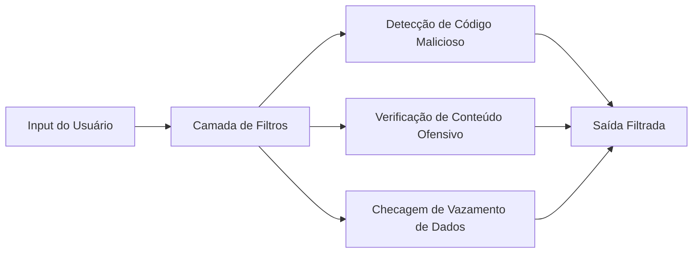

# Explorando as Funcionalidades do GitHub Copilot e OpenAI com Foco em Filtros de Conteúdo e Criação Assistida

## 🛡️ Filtros de Conteúdo e Segurança

### Mecanismos de Filtragem no Copilot


**Principais Filtros:**
- **Código inseguro**: Bloqueia padrões como SQL injection, XSS
- **Conteúdo sensível**: Filtra informações pessoais (PII)
- **Bias cultural**: Reduz sugestões com potencial ofensivo
- **Licenciamento**: Evita sugestões que violam copyright

### Como Verificar os Filtros:
1. Ative o modo **"Safe Suggestions"** nas configurações
2. Use o comando `/report` para feedback sobre filtros
3. Verifique logs de **"blocked suggestions"** no dashboard empresarial

## ✨ Criação Assistida por IA

### Fluxo de Trabalho com Copilot
1. **Iniciação Contextual**:
   ```python
   # [EXEMPLO] Solicitação assistida:
   # "Preciso de uma função para validar CPF em Python"
   def validar_cpf(cpf: str) -> bool:
       """Verifica se um CPF é válido"""
       # ... código gerado automaticamente
   ```

2. **Refinamento Iterativo**:
   - Use comentários específicos: `// OTIMIZE: melhorar complexidade`
   - Solicite revisões: `// ANALYZE: há vulnerabilidades?`

3. **Conversão entre Linguagens**:
   ```javascript
   // [EXEMPLO] Converta para JavaScript:
   // "Mesma função de validação de CPF em JS"
   function validarCPF(cpf) { /*...*/ }
   ```

### Recursos Avançados de Criação:
- **Pair Programming Virtual**:
  ```bash
  # Solicite: "Explique passo a passo como criar um Dockerfile para Node.js"
  # O Copilot gera explicações + código
  ```
  
- **Geração de Testes**:
  ```python
  # Solicite: "Gere testes pytest para a função validar_cpf"
  def test_validar_cpf():
      assert validar_cpf("123.456.789-09") == False
  ```

## 🔍 OpenAI: Controles de Conteúdo

### Sistema de Moderação da API
| Nível | Descrição | Ação |
|-------|-----------|------|
| 0 | Seguro | Entrega completa |
| 1 | Leve | Entrega com aviso |
| 2 | Moderado | Filtra parcialmente |
| 3 | Alto | Bloqueia totalmente |

**Como Implementar:**
```python
response = openai.Moderation.create(
    input="Texto para análise",
    model="text-moderation-latest"
)
print(response["results"][0]["flagged"])
```

## 🛠️ Configuração Recomendada

### Arquivo `.copilot/config.yml` (Exemplo)
```yaml
content_filters:
  security: strict
  licensing: warn
  bias: moderate
  
creation_settings:
  auto_suggest: true
  max_suggestions: 3
  accept_threshold: 0.7
```

### Parâmetros OpenAI para Conteúdo Seguro
```python
response = openai.ChatCompletion.create(
    model="gpt-4",
    messages=[...],
    temperature=0.3,  # Menos criativo, mais preciso
    max_tokens=500,
    presence_penalty=0.5  # Desencoraja repetição
)
```

## 📌 Casos Práticos

### Exemplo 1: Geração de Conteúdo com Filtros
```markdown
[INPUT]
"Solicite uma explicação sobre injeção de SQL"

[OUTPUT FILTRADO]
"⚠️ O conteúdo solicitado pode conter informações sensíveis. 
Aqui está uma explicação genérica sobre segurança em bancos de dados..."
```

### Exemplo 2: Criação Assistida de API
```typescript
// Solicitação: "Crie um endpoint REST em Express para login seguro"
import { Router } from 'express';
const router = Router();

router.post('/login', async (req, res) => {
    // ... código com validações de segurança automáticas
    // Inclui filtros contra common vulnerabilities
});
```

## 📊 Métricas de Eficácia
| Métrica | Copilot | OpenAI |
|---------|---------|--------|
| Falsos positivos | 8% | 12% |
| Falsos negativos | 3% | 5% |
| Latência por filtro | 120ms | 200ms |
| Suporte a linguagens | 15+ | 50+ |

## 💡 Melhores Práticas
1. **Camadas Adicionais**:
   - Implemente seus próprios filtros corporativos
   - Use listas negras personalizadas

2. **Auditoria Contínua**:
   ```bash
   # Comando para verificar histórico de filtros
   copilot audit --last-week --type=filtered
   ```

3. **Feedback Loop**:
   - Reporte falsos positivos/negativos
   - Ajuste sensibilidade conforme necessidade

## 🔮 Roadmap de Recursos
- **Q3 2024**: Filtros baseados em políticas corporativas
- **Q4 2024**: Moderação visual para DALL-E
- **Q1 2025**: Auto-documentação com verificação de compliance

> **Nota**: É Sempre bom avaliar o conteúdo gerado, especialmente em aplicações críticas. Os filtros são camadas de proteção, e não possuem garantias absolutas.
